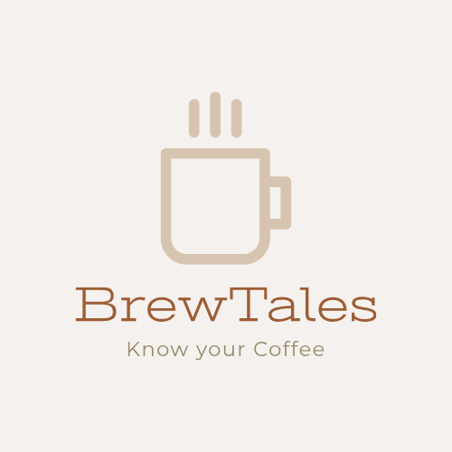
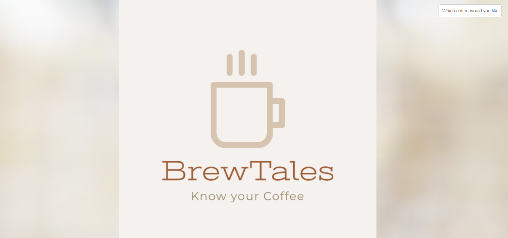

# Flatiron-Frontend-phase1-project
My Flatiron-Frontend-Phase1 project
                BrewTales - Your Coffee Encyclopedia 🍵☕




Welcome to BrewTales, your ultimate guide to the fascinating world of coffee! Whether you are a coffee enthusiast or just curious about the history and different types of coffee, this website is the perfect destination for you.

Table of Contents are as follows
Introduction
Features
How to Use
Installation instructions
Technologies Used
Contributing Factors
License


Introduction:
BrewTales is an educational website that delves into the rich history of coffee and provides information about various types of coffee drinks from around the world. It offers a delightful experience of discovering the origins, evolution, and unique characteristics of each coffee type.

BrewTales Screenshot-!(<>)

Features:
Explore the History: Learn about the intriguing journey of coffee from its origins in Ethiopia to becoming a global sensation, popularized through vibrant coffee houses.

Discover Coffee Types-- Discover a diverse range of coffee types, from classic Espresso to exotic Turkish Coffee, each with its own distinct flavor and preparation methods.

Search Functionality--Use the search bar to find specific coffee types easily. Just start typing the coffee name, and BrewTales will display relevant results.

Interactive Interface-- Enjoy a visually appealing and user-friendly interface that makes your coffee exploration experience engaging and enjoyable.

Clickable Coffee Images-- Click on the coffee images to instantly view detailed information about each coffee type.

How to Use:
Visit the BrewTales Website and explore the fascinating world of coffee history and types.

Use the search bar to quickly find information about your favorite coffee types.

Click on the coffee images to view detailed descriptions and images of each coffee type.

Installation instructions:
Prerequisities
- Make sure you have Node.js and npm (Node Package Manager) installed on your system.
STEP 1: clone the repository
```bash
git clone https://github.com/Yuti07/Flatiron-Frontend-phase1-project
cd brewtales-website

STEP 2: Install Dependencies
```bash
npm install
```bash
npm start

This command will launch the development server, and you can access the website in your browser at http://localhost:3000.

Technologies Used:
HTML5
CSS3
JavaScript
JSON

Contributing Factors:
We welcome contributions from the coffee community to make BrewTales even better! If you find any issues or have ideas for improvement, feel free to open an issue or submit a pull request.

License:
BrewTales is licensed under the MIT License.

Enjoy your journey through BrewTales, and may your coffee experiences be always filled with joy and delight!

